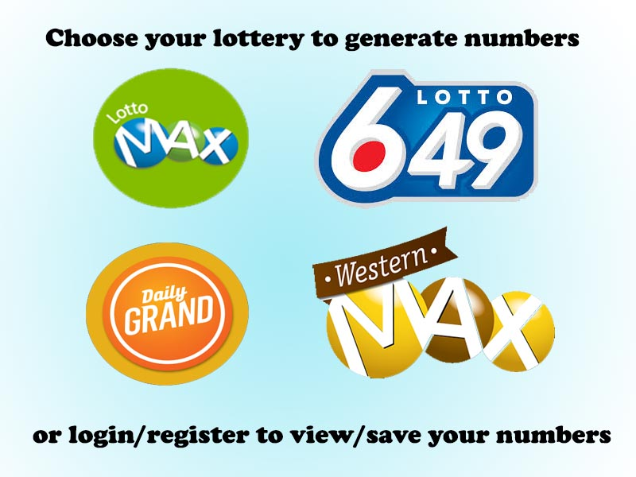
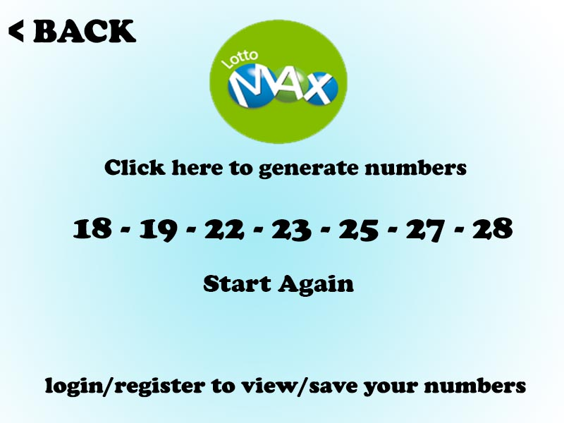

# Passion-Project

# Canada Lottery Random Number Generator

### Elevator Pitch

An app that generates random lottery numbers for people who can't think of any numbers and don't want the lottery machine to pick numbers for them. There is a variety of lottery games in Canada to choose from (Example: Lotto Max, Lotto 6/49, etc.). You can also login and save the numbers you generated for future reference.

### Functional Requirements

1. User should be able to choose the type of lottery (example: lotto max, lotto 6/49, etc.).
2. User should be able to generate random lottery numbers based on the type of lottery they choose.

### Non-Functionl Requirements

1. Compatibility
2. Responsiveness

### Must Have Features

1. Generate Random Lottery Numbers
2. Wide variety of canada lottery games to choose from

### Nice to Have Features

1. Login / Registration page
2. Save generated numbers for future reference

### Relational Database

### Prototype

 

